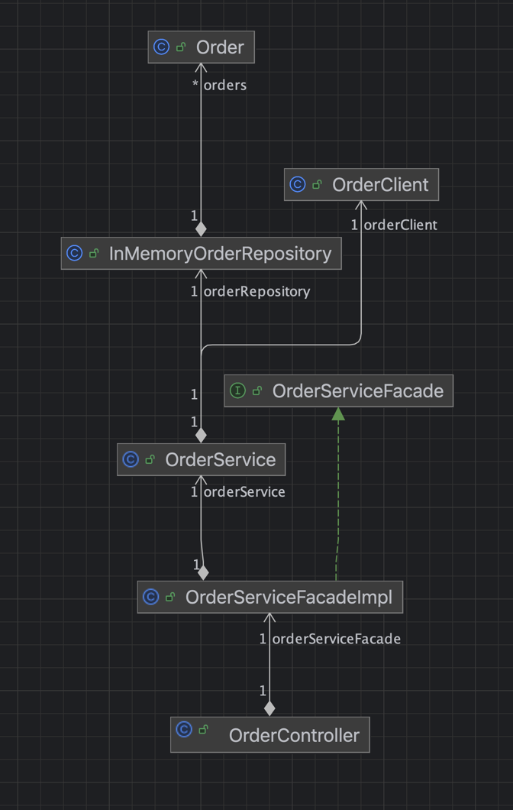

# 주문 관리 시스템

## 요구사항
### 
1. 외부 시스템에서 JSON 형식의 주문 데이터를 HTTP를 통해 받아와 내부 시스템에 저장
2. 주문 데이터를 내부 시스템에서 JSON 형식으로 변환하여 외부 시스템으로 전송
3. 주문은 주문 ID, 고객 명, 주문 날짜, 주문 상태(예: 처리 중, 배송 중, 완료) 등의 속성
4. 저장된 주문 데이터는 주문 ID를 통해 조회 가능
5. 저장된 주문 데이터를 리스트 형식으로 반환 (조회 시)
6. 예외 처리
7.  클래스 다이어그램 작성: 외부 시스템과의 데이터 연동을 담당하는 주요 클래스와 이들 간의 관계를 나타내는 클래스를 설계하세요. 각 클래스의 역할과 책임을 간단히 설명하세요.

## 개발 환경
* framework - spring boot 3.2
* java version -  17
* idle - intelij
* scm - github

## 클래스 다이어그램

* OrderController - 사용자 요청을 받는 컨트롤러
* OrderServiceFacade -  OCP (Open Closed Principle) (개방, 폐쇄 원칙이라고 하며 '소프트웨어 개체(클래스, 모듈, 함수 등)는 확장에 대해 열려 있어야 하고, 수정에 대해서는 닫혀 있어야 한다.'는 프로그래밍 원칙입니다.)  개방 폐쇄 원칙 으로 인한  인터페이스 추가
* OrderServiceFacadeImpl - 확정성을 고려한 facade 패턴  서비스 간 gateway 역할을 수행 하도록 작성
* OrderService - 실제 로직 수행 서비스
* InMemoryOrderRepository - 메모리 저장소 역할 수행
* Order - 저장 데이터 필드
* orderClient - 외부 호출 담당하는 역할
